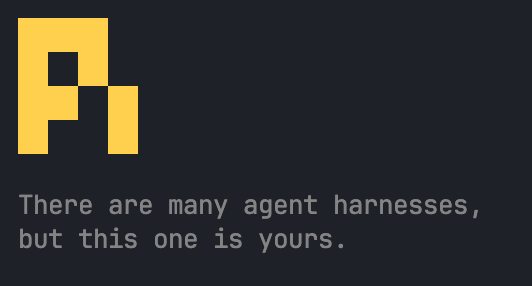

# pi-pixel-header

**Pixel Pi logo header with random Catppuccin Mocha accent colors for your TUI.**

[](https://www.npmjs.com/package/pi-pixel-header)
[](https://opensource.org/licenses/MIT)

## Why

A pixel art rendition of the [pi.dev](https://pi.dev) official logo, brought into your TUI as a custom header — a small tribute to the project.

Each session randomly picks a new accent color from the Catppuccin Mocha palette, so the logo looks different every time you launch Pi.

## Install

```bash
pi install npm:pi-pixel-header
```

## What It Looks Like



Available colors: blue, green, mauve, peach, lavender, teal, yellow, flamingo.

## Commands

| Command | Description |
|---------|-------------|
| `/default-header` | Restore the built-in Pi header |

## License

MIT
